# Tourist Attractions
### Welcome!
> Click this button for other ideas

<html>
<head>

</head>
<body>

<button onclick="window.location.href='https://www.tripadvisor.com/Attractions-g147423-Activities-Out_Islands_Bahamas.html/';">Click here to learn more about attractions!</button>

</body>
</html>

#  Need Ideas on what to do? Watch this video!
<html>
   <head>
      <title>---</title>
   </head>
   <body>
      <iframe width="560" height="315" src="https://www.youtube.com/embed/Hnsb3zXVZn8" title="Video" frameborder="0" allow="accelerometer; autoplay; clipboard-write; encrypted-media; gyroscope; picture-in-picture; web-share" allowfullscreen></iframe>
    </body>
</html>

 
 
>  Ready to go on the most fun and exciting adventure? 
> What’s better than an exotic island with breathtaking viewpoints?
> It boasts stunning viewpoints, the opportunity to explore beautiful scenery, to swim in natural rock pools and magnificent local bars for adults to enjoy.

 
  

    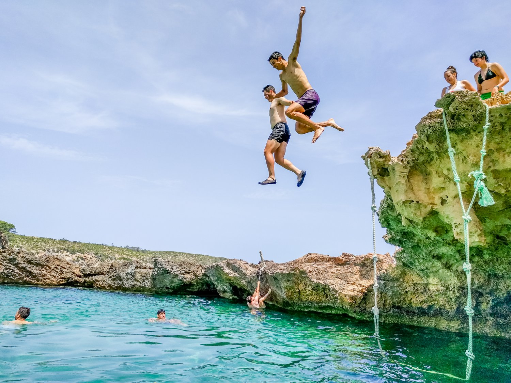
  

   

    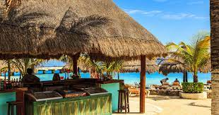
  

   

    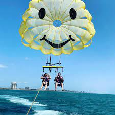
  

> This  island has a lot to offer – whether you’re an outdoor enthusiast itching to enjoy incredible hikes, or looking for a romantic getaway with your loved one.
> Here are a list of fun children friendly activities to do while on the island.

### Waterfall Experiences
> Waterfalls are some of the most stunning sites in on this Island.
You can walk to and swim underneath waterfalls, feeling the amazing rush of the water on your skin , plus, you can have a picnic right near them.
> This is where to go for seeing stunning waterfalls of various heights.

 
  

    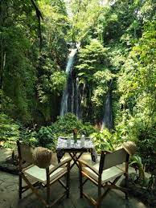
  

   

    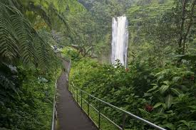
  

   

    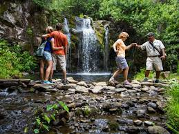
  

>It’s an amazing place for enjoying great food and having fun and spending quality time with your family.

### Beach Surfing
> Surfing is one of the best things to do while on this Island.
This beach has waves that are ideal for newcomers looking to learn the fundamentals while also catching a few waves. If children also would like to get an experience, we have trainers to get them started and have the best time of their lives!

 
  

    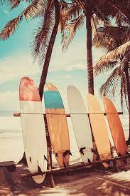
  

   

    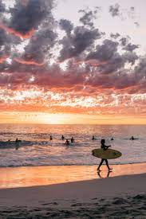
  

   

    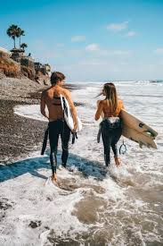
  

### Kala National Park
> Kala National Park  is one of the most beautiful places on this Island.
This is a downhill hike, enjoyable for all ages. It’s one that can you have absolutely speechless as you take in the scenery that’s surrounding you.
Besides the breathtaking scenery, there are also gorgeous animals and plants that you’ve likely never seen before. And good news is that you can also camp overnight at this park.

 
  

    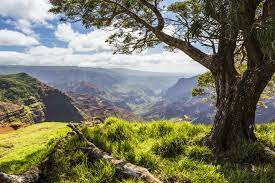
  

   

    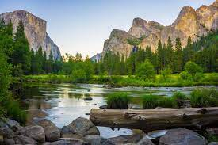
  

   

    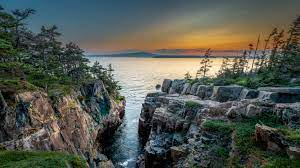
  

### Whale Watching
> Kids this might one of your favorite activities! 
> You’ll bound to be amazed by seeing whales in their natural habitats of these beautiful waters.
But keep in mind you’ll to take out time from your trip if you want to go whale watching, as they’re not always going to be visible!

 
  

    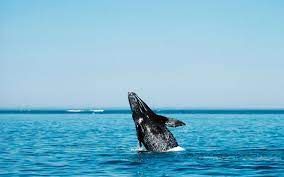
  

   

    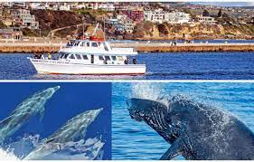
  
  

### Windsurfing
> Along with surfing, we also have windsurfing, the waves in here are too good to be ignored.
Although it can take some time to get your balance, it’s lots of fun and quite addictive once you get the hang of it. Windsurfing should be on any adventurous person’s bucket list, sorry kids might have to wait a few years, as we do not reccomend kids trying this out.

 
  

    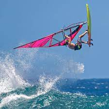
  

   

    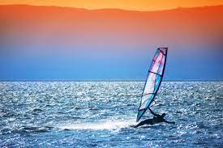
  
  

### Snorkeling and Sailing
The activity that gets almost everyone hyped up! Snorkeling! 
> This is one of the best parts of this island take the plunge and go snorkeling in, as well as sailing.
This is tons of fun and very comfortable and you’ll also be provided with lunch and a bar.

 
  

    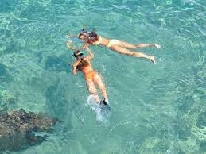
  

   

    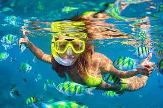
  
  

### Nighttime Paddleboarding
> Nothing better than being on the beach after sunset and witnessing the night sky while out in the cool ocean! 
> You should go paddleboarding at least once while you are here, but if you really want to make it an amazing experience, you should go for a nighttime paddleboarding experience.
> These trips start a little before sunset and dont worry your paddleboard will have lights on it, making it easy to navigate and see the undersea life below you.

 
  

    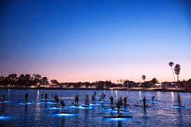
  

   

    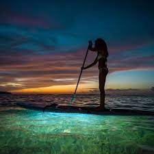
  
  

### Helicopter Tours
Yes you saw right! We also offer fun helicopter tours around the island. The helicopter tours let you soak in the scenery of this breathtaking island and the waters look especially lovely when you’re from this  point.

 
  

    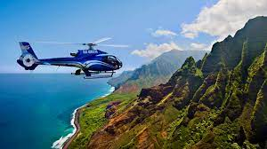
  

   

    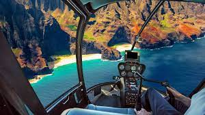
  

###  Arts & Cultural Center
> Despite the beautiful scenery places, it is also important to learn and see the the traditions of this island and it's specialities. 
> You can see many great performers at this venue, which also includes acting and dancing performances.

 
  

    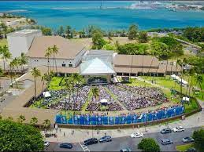
  

   

    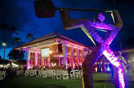
  

### Activities dedicated to kids
> These are some fun activties for your kids to enjoy while on this island. There is also an option to enroll you kid into "daycare" and sign them up for these activities as our trusted staff take care of them!
### Jeep Eco-Tour

 
  

    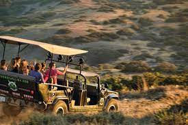
  

### Golf Gardens

 
  

    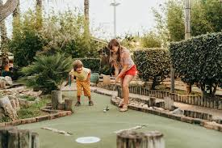
  

### Zip Line

 
  

    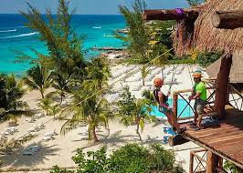
  

### Movie Night (Every Night at 8 pm)

 
  

    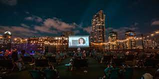
  

### Aquarium

 
  

    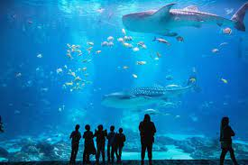
  

### Fun Contests: kids paired with their parents can particpate in several contests including:
      - sand castle building contest
      - scavneger huny
      - best tropical costume contest

 
  

    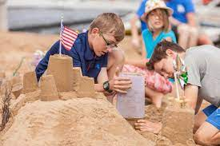
  

  
  