# *Animals*
> This island has great wildlife! See below for a guide on which birds, fish, and animals to look out for!

## Birds

| Bird | Scientific Name | Size  
| --- | --- | --- | --- |
| Puaiohi | Myadestes palmeri | 6.5 in |
| Hwamei | Garrulax canarus | 10 in |
| Common Myna | Acridotheres tristis | 9 in |
| | | | | |
| Saffron Finch | Sicalis flaveola | 7 in |
| Akepa | Laxops coccineus | 4 in |
| Apapane | Himatione sanguinea | 5 in |
| | | | | |
| 'I'iwi | Vestaria coccinea | 6 in |
| Akekee | Laxops coeruleirostris | 4.5 in |
| Palila | Laxioides bailleui | 7.5 in |
| | | | | |

 
  

    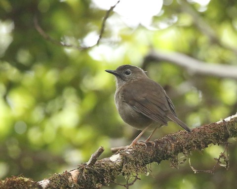
  

   

    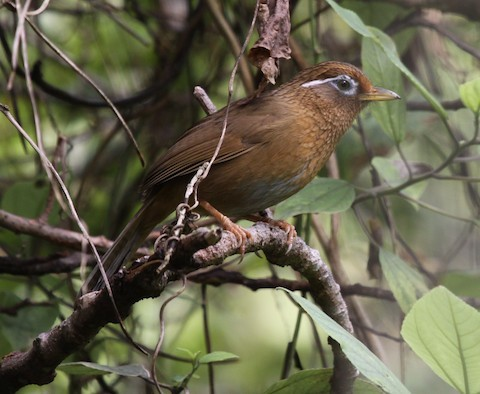
  

   

    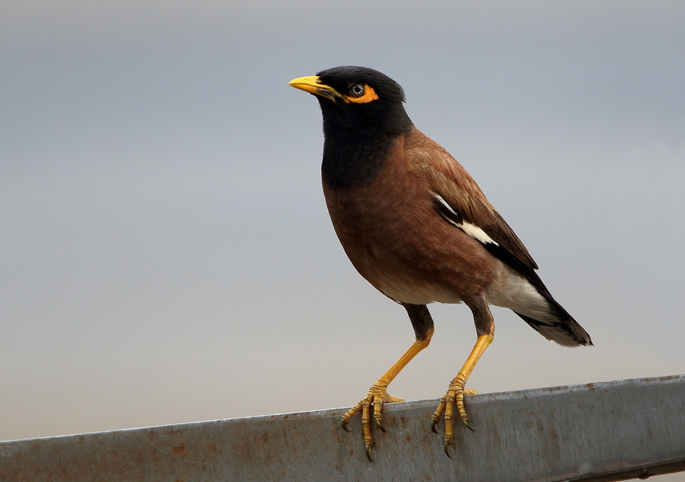
  

 
  

    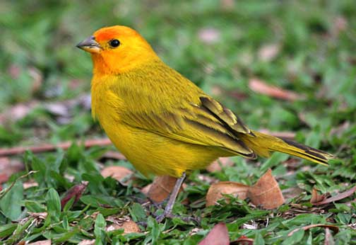
  

   

    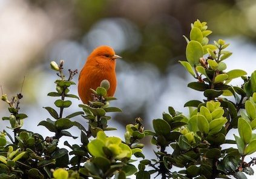
  

   

    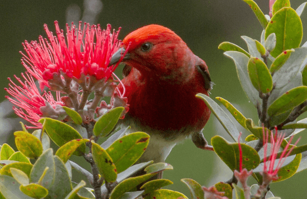
  

 
  

    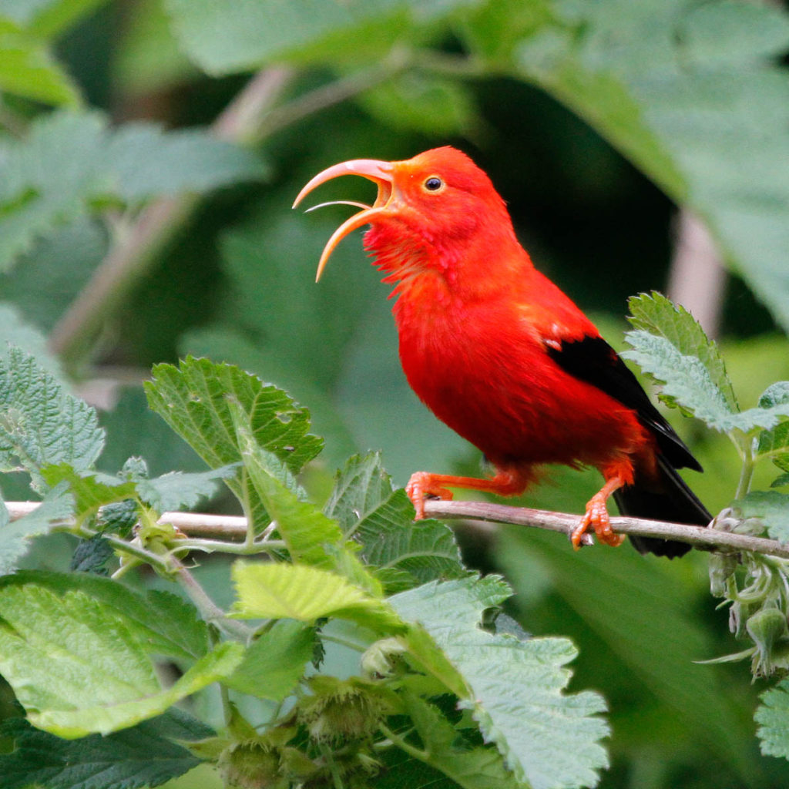
  

   

    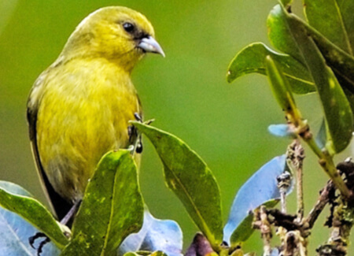
  

   

    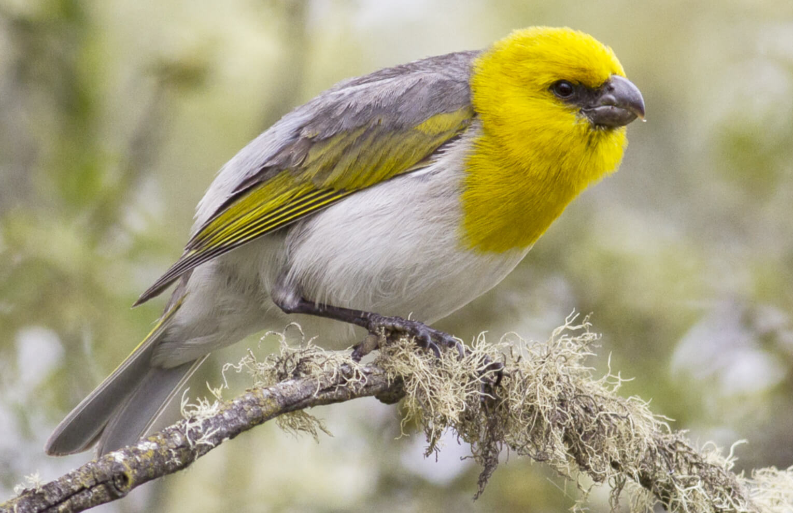
  

    

## Mammals
> Below are a few beautiful native species that are unfortuneately endangered. Donate [here](https://www.hawaiiwildlifecenter.org/) to help them.

 
  

    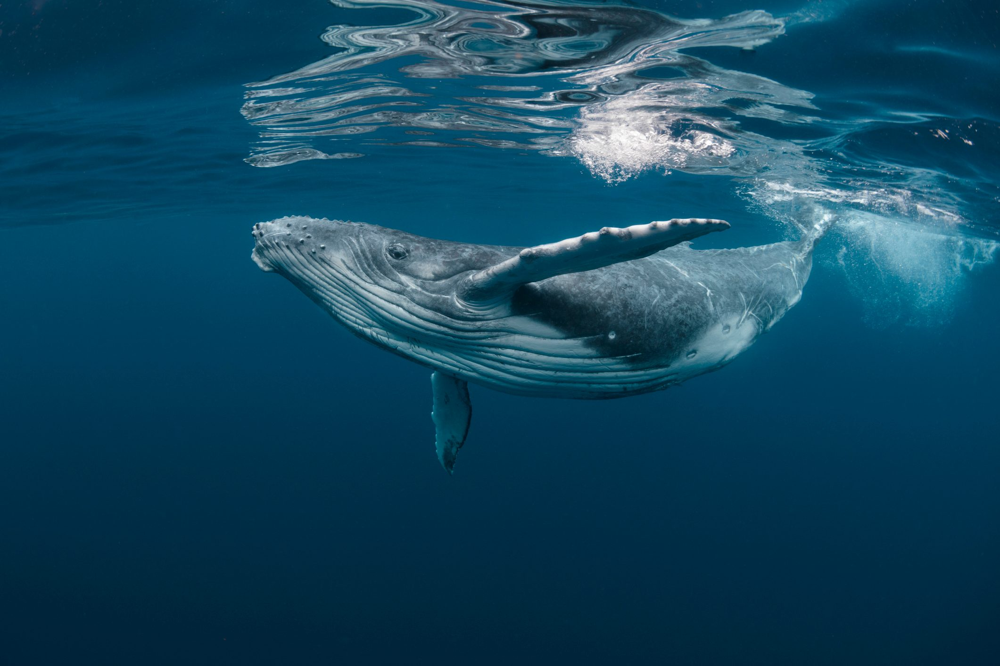
  

  

    
  

  

    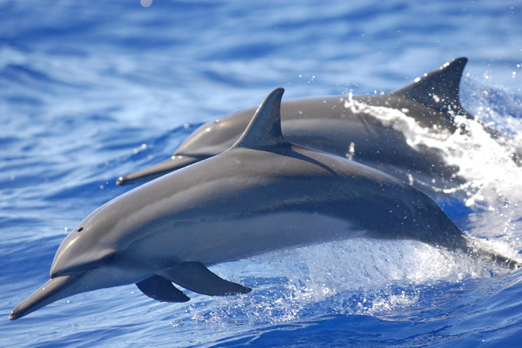
  

## Reptiles

> The Gold Dust Gecko is a gorgeous species. It is extremely friendly and is a popular choice for a pet. Although it has red spots typically assoicated with poison, this gecko is harmless. It eats nectar and insects.

 
  

    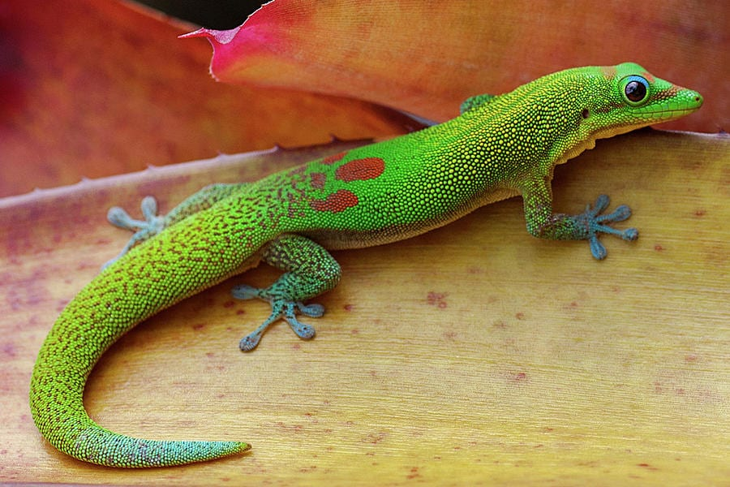
  

  

    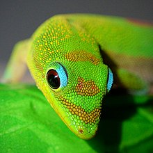
  

> The Gehyra mutilata is an adorable gecko that is known for its 4 claws and stumpy toes. It is a purple/ pink gray color, and can make chirping noises to attract crickets.

 
  

    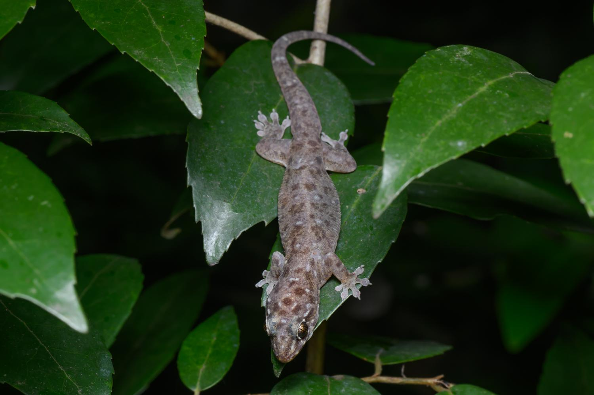
  

  

    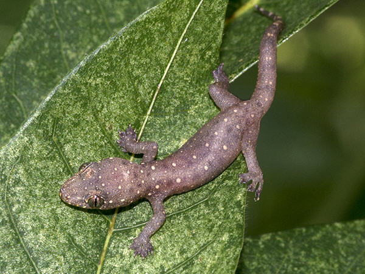
  

  

    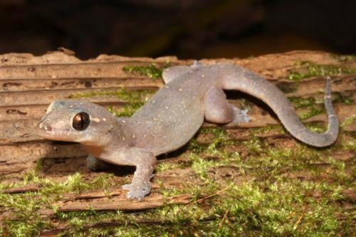
  

