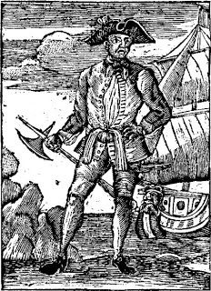

# History
 
 
Prepare to follow in the footsteps of some of the most famous (and infamous) sailors of the West Indies... Both prince and pirate have set foot on this very island, and you'll get to learn all about it!
 
 
 

### Sweet Cargo

> During the Golden Age of Piracy (1650s-1730s), privateers-turned-pirate needed remote and uncharted islands to stash the cargo they had looted from royal ships. France, Britain, and Spain were heavily robbed, but not for gold, like you might have thought. The most precious loot for pirates was sugar and rum; both could fetch a fair price, worth more than enough of their weight in gold.  

 
  

    
  

   

    
  

   

    
  

 
 
 

### The REAL Prize

> After their cargo was acquired and sold, what should a pirate do with their gold?
 
 
Bury it on our island of course!
The famed treasure of Benjamin Hornigold was hidden on this very island, and is now located in our Museum of Piracy. Keep scrolling to learn why it is so valuable.

 
  

    
  

   

    
  

   

    
  

 
 
 

### Prosperous Pirates

> If you're not a pirate enthusiast like us, Hornigold may not ring any bells. Neither will Samuel Bellamy. What about Edward Thatch. No? What about... Blackbeard!!! Thought so.
 
 
Black Sam Bellamy and Blackbeard both started as crew members for Benjamin Hornigold who is often considered the og pirate of the Golden Age. Hornigold appreciated young Edward Thatch's talents and gifted him a ship to start his personal career as the great Blackbeard. Hornigold could have never imagined that he would be matched and surpassed by his pupil, but the pair acknowledged each other and sailed together for a short (and terrifying) period of time. Based on the map we found and scientific analysis of the coins on our island, the treasure buried here was from that very series of voyages! 
- Two of the most prosperous pirates
- Real gold 
- One-of-a-kind treasure map
Why miss this opportunity?

 
  

    
  

   

    
  

   

    
  

 
 
 

### Royal Company

> Though the larger islands around us were colonized by British, Spanish, and French empires, the size and seclusion of our island left it a pirates-only hideout. After the Golden Age began to dwindle, royal visits began.
 
It's no surprise this is a favored travel destination for the blue-blooded; blue skies, blue waters, and no blue feelings in sight. Trips were often undocumented, however, to protect the provacy of our donors. 

 
  

    
  

   

    
  

   

    
  

 
 
 

### The Main Attraction

> If you're interested in learning more and seeing these rare sights in person, don't hesitate to visit our Museum of Piracy!

 
  

    
  

   

    
  

   

    
  

 
 
<html>
  <head>
    <title>---</title>
  </head>
  <body>
    <button onclick="window.location.href='https://www.thepiratemuseum.com/';">
      Museum Information
    </button>
  </body>
</html>
 
 
### Open 12:00 pm to 5:00 pm Mon-Sat

### Free admission for children 10 and younger

### Free admission every Thursday

### Dining options available
