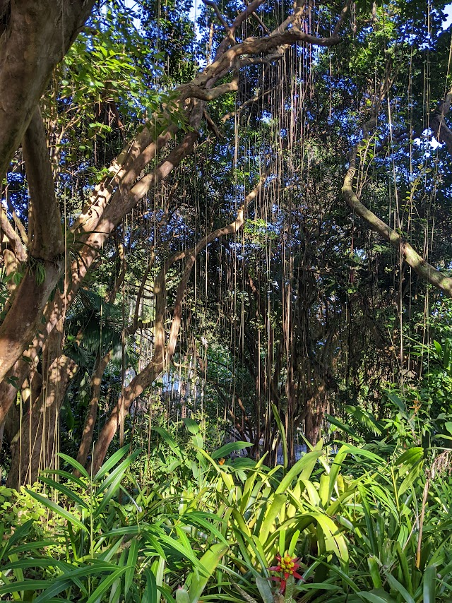
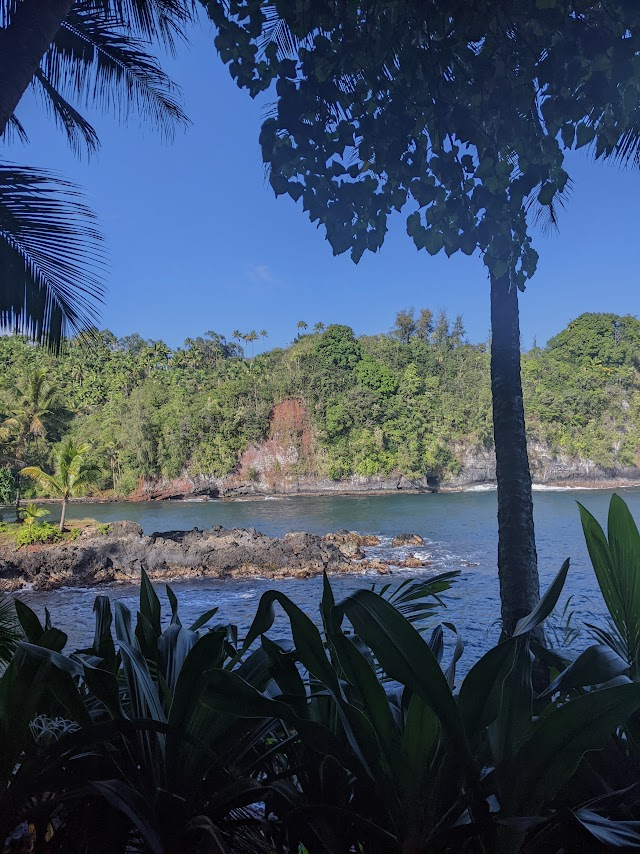
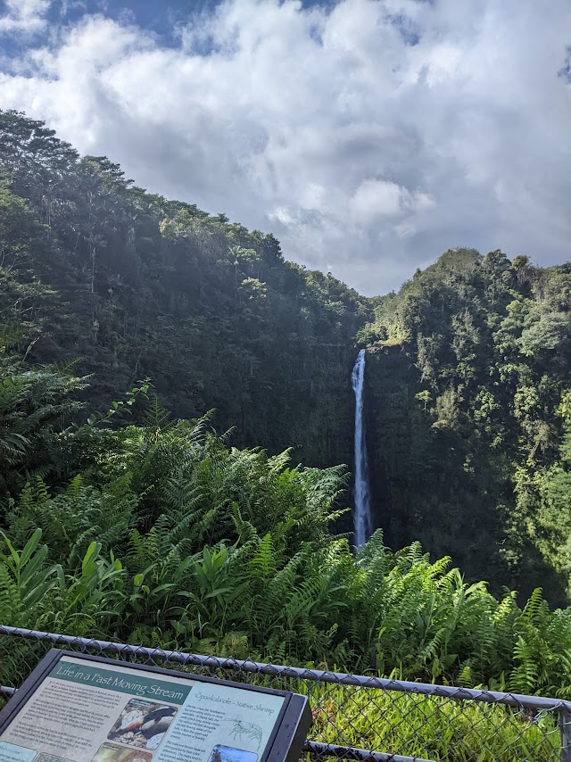
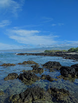
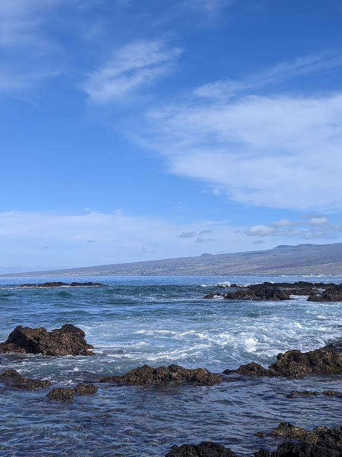
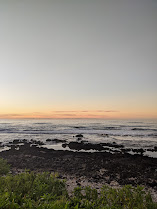
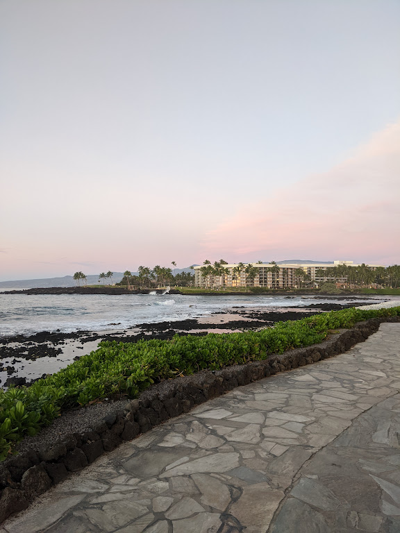
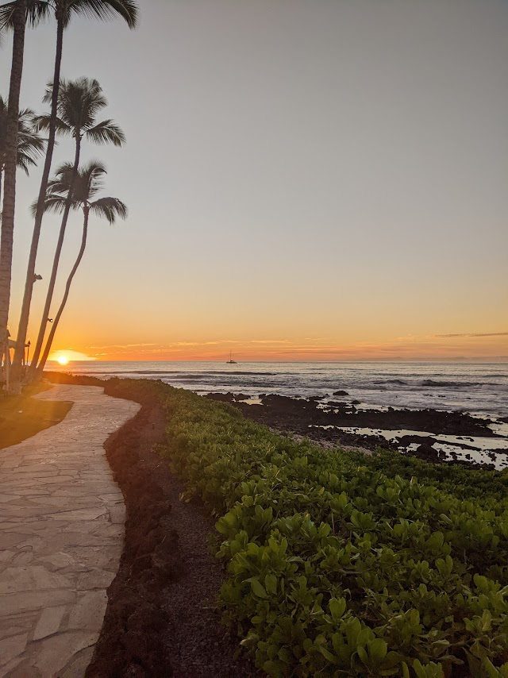
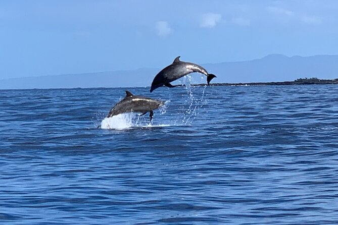

# **Nature Locations**
Here are the different nature spots you should visit!
 
 

## Tropical Bioreserve 
> *Filled with exotic plants and beautiful geological formations, this spot provides breathtaking scenery and a relaxing hike*
 
 

These are just some examples of the beautiful sights at this location:

 
  

    
  

   

    
  

   

    
  

 
  

    
  

   

    
  

   

    
  

 
 

<table class="tg">
<thead>
  <tr>
    <th class="tg-0pky">Plant's at this location</th>
    <th class="tg-0pky">What to look for</th>
  </tr>
</thead>
<tbody>
  <tr>
    <td class="tg-zh46">Hibiscus tiliaceus – Hau</td>
    <td class="tg-0pky"></td>
  </tr>
  <tr>
    <td class="tg-zh46">Sadleria cyatheoides – Amaumau Fern</td>
    <td class="tg-0pky"> </td>
  </tr>
  <tr>
    <td class="tg-zh46">Ipomoea indica – Oceanblue Morning-glory</td>
    <td class="tg-0pky"> </td>
  </tr>
  <tr>
    <td class="tg-zh46">Hedychium gardnerianum – Kahili Ginger</td>
    <td class="tg-0pky"> </td>
  </tr>
  <tr>
    <td class="tg-zh46">Medinilla magnifica – Rose Grape</td>
    <td class="tg-0pky">  </td>
  </tr>
  <tr>
    <td class="tg-fgy3">Phaius tancarvilleae – Nun's-hood Orchid</td>
    <td class="tg-0lax"> </td>
  </tr>
</tbody>
</table>
 
 

## Akaka Falls
> *Visit this 442 foot drop of raging water and see the beautiful green nature surrounding it!* 

 
  

    
  

   

    
  

 
 

## Holoholokai Beach Park
> *This is a beautiful rockey shoreline with picnic areas are scenic views*

 
  

    
  

   

    
  

 
 

## Sunset Beach 
> *Visit this beach for a relaxing atmosphere, great restaurants, and beautiful sunset*
 

 
  

    
  

   

    
  

   

    
  

 
 
 

## Dolphin Watching at North Shore
> *Dolphin watching and interactions

 
  

    
  

 
 
 

<html>
  <head>
    <title>---</title>
  </head>
  <body>
    <button onclick="window.location.href='https://www.hawaiitours.com/to-do/the-encounter/?utm_term=&utm_campaign=Sales-Performance+Max+-+California+-+Top+Performing+Demographics&utm_source=google&utm_medium=cpc&hsa_acc=3498969537&hsa_cam=18934892623&hsa_grp=&hsa_ad=&hsa_src=x&hsa_tgt=&hsa_kw=&hsa_mt=&hsa_net=adwords&hsa_ver=3&gclid=CjwKCAiAk--dBhABEiwAchIwkQjcJMGieCKfQUpqR9Tp9hrwnoB1u7NoMMR5732WWJJHTgg0AcB4gRoCAqMQAvD_BwE;'">
      Click here for info on dolphin tours!
    </button>
  </body>
</html>

